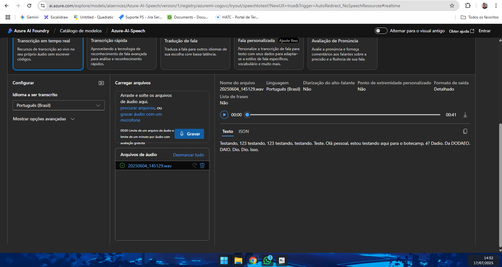
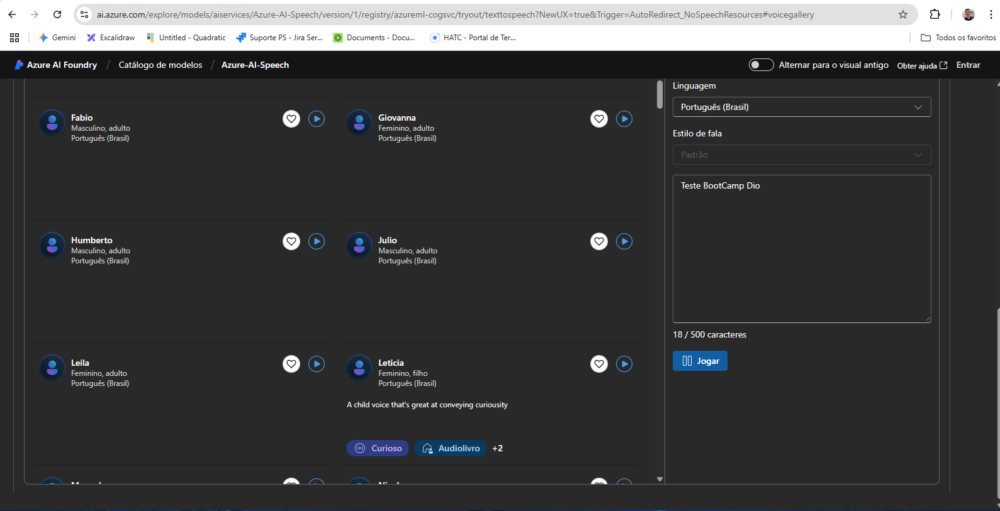

# Azure AI Lab - DIO

## Introdução

Este repositório documenta a exploração dos serviços Azure Speech Studio e Language Studio, com foco na análise de fala e linguagem natural. O objetivo é aplicar os conceitos aprendidos em um ambiente prático e compartilhar as experiências adquiridas.

## Azure Speech Studio

### Funcionalidades Exploradas

- **Speech-to-Text**: Conversão de áudio em texto.
- **Text-to-Speech**: Conversão de texto em fala.
- **Custom Speech**: Criação de modelos personalizados para melhorar a precisão do reconhecimento de fala.

### Observações

- A interface é intuitiva e permite a criação de projetos sem necessidade de codificação.
- A precisão do reconhecimento de fala pode ser aprimorada com modelos personalizados.

## Azure Language Studio

### Funcionalidades Exploradas

- **Análise de Sentimento**: Determinação do tom emocional de um texto.
- **Extração de Frases-chave**: Identificação dos principais tópicos de um texto.
- **Detecção de Idioma**: Identificação do idioma de um texto.
- **Classificação de Texto**: Classificação de textos em categorias predefinidas.

### Observações

- As ferramentas oferecem uma análise detalhada e precisa dos textos.
- A integração com outros serviços do Azure facilita a criação de soluções completas.

## Conclusão

A exploração dos serviços Azure Speech Studio e Language Studio proporcionou uma compreensão prática das capacidades de análise de fala e linguagem natural da Azure. As ferramentas são poderosas e oferecem recursos avançados para o desenvolvimento de soluções baseadas em inteligência artificial.

## Links Úteis

- [Azure Speech Studio](https://speech.azure.us/)
- [Azure Language Studio](https://language.cognitive.azure.com/)
- [Documentação do Azure Speech Service](https://learn.microsoft.com/en-us/azure/ai-services/speech-service/)
- [Documentação do Azure Language Service](https://learn.microsoft.com/en-us/azure/ai-services/language-service/)
